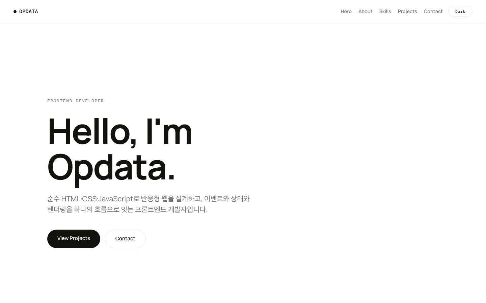
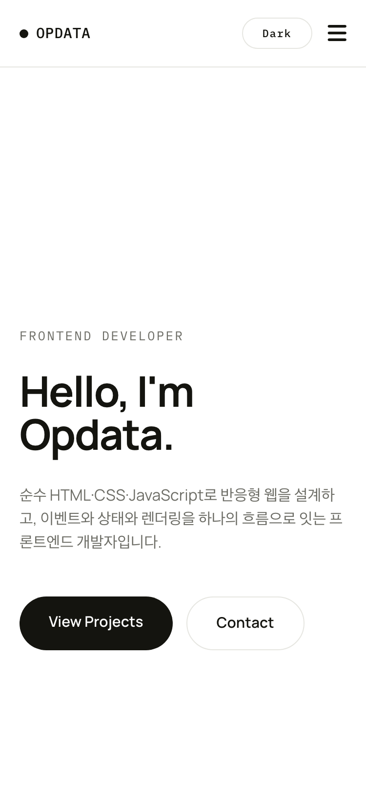
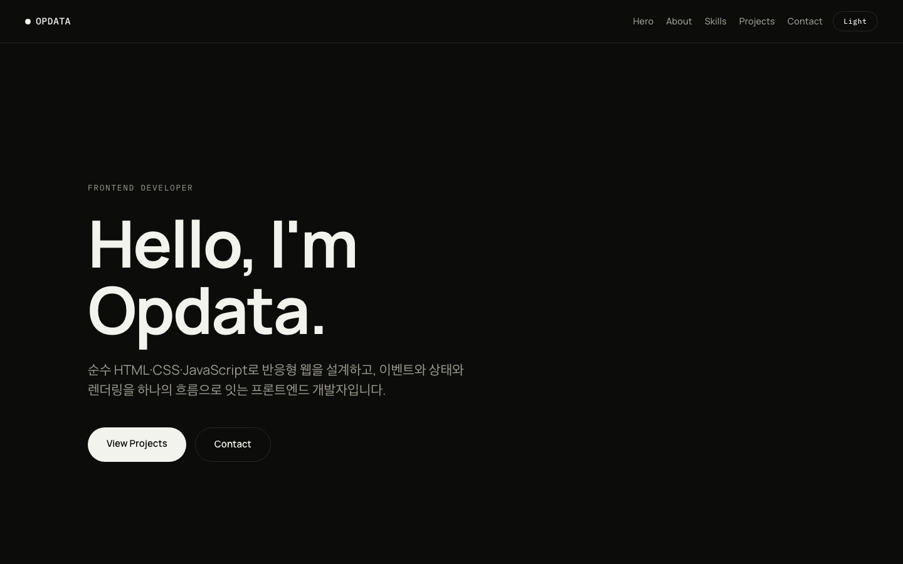

# Opdata Portfolio

순수 HTML / CSS / JavaScript만으로 구현한 반응형 포트폴리오 웹사이트.
외부 라이브러리 없이 "사용자 이벤트 → 상태 변경 → DOM 렌더링" 흐름을 결과물로 구현했다.

## 배포 URL

https://opdata.github.io/codyssey-vanillaPage/

## 사용 기술

- **HTML5** — 시맨틱 마크업
- **CSS3** — CSS 변수, Flexbox / Grid, 모바일 퍼스트 반응형, 다크 모드
- **JavaScript (ES6+)** — GitHub API 연동(fetch/async·await), 상태 기반 렌더링, 폼 유효성 검사, IntersectionObserver

## 변경한 기준값

| 항목 | 값 |
|---|---|
| 네비게이션 배경 변경 스크롤 | 60px |
| 스크롤 탑 버튼 표시 스크롤 | 300px |
| IntersectionObserver threshold | 0.2 |

## 스크린샷

| 데스크톱 | 모바일 | 다크 모드 |
|---|---|---|
|  |  |  |
